```mermaid
graph TB
    subgraph Client["Browser / Client"]
        UI["Next.js 14 + React 18\n(TypeScript, TailwindCSS)"]
        UI_PAGES["App Router Pages\n/login · / (Dashboard)\n/landing · /deal/[dealId]"]
        UI_HOOKS["Hooks & State\nuseDeals · useMatrix\nuseInvestigation\nlocalStorage cache"]
        UI_API["API Client (lib/api.ts)\nBearer JWT token\nProxy: /api → backend:8000"]
    end

    subgraph Backend["Backend — FastAPI (Python 3.12)"]
        API["FastAPI + Uvicorn\nport 8000\nSSE Streaming\nJWT + RBAC auth"]

        subgraph Routes["API Routes (14 routers)"]
            R_AUTH["/auth\nregister · login · me\ngrant_deal_access"]
            R_DEALS["/deals\nCRUD · doc listing\ndownload"]
            R_INGEST["/deals/{id}/documents\nPDF/Excel upload\nstreaming progress"]
            R_QUERY["/deals/{id}/query\nSingle-deal Q&A"]
            R_WORKSTREAM["/workstream\nPre-built question sets\nFinancial/Commercial\nLegal/Operational"]
            R_MATRIX["/matrix/stream\nCross-deal comparison\nSSE streaming"]
            R_DOCMATRIX["/deals/{id}/documents/matrix\nPer-doc prompt sheet\nSSE streaming"]
            R_AGENT["/deals/{id}/investigate\nAutonomous agent\n(AGENTIC_FEATURES flag)"]
            R_REPORT["/report\nDOCX generation"]
            R_SWEEP["/sweep\nProactive risk scan"]
            R_INTERNAL["/internal\nInternal token auth\nfor AI service"]
        end

        subgraph Services["Core Services"]
            SVC_PARSER["parser.py\nDocling subprocess\nPDF → Markdown+tables"]
            SVC_CHUNKER["chunker.py\n1000-char chunks\n200-char overlap"]
            SVC_EMBEDDER["embedder.py\nGemini embedding-001\n3072-dim vectors"]
            SVC_VECTOR["vector_store.py\nChromaDB client\nper-deal collections"]
            SVC_DEAL["deal_store.py\nSQLAlchemy CRUD"]
            SVC_REPORT["report_generator.py\npython-docx\nStyled DOCX builder"]
        end

        subgraph Agents["AI Agents (LangGraph)"]
            AGT_QA["single_deal_qa.py\nRAG Q&A\nCitation extraction"]
            AGT_COMPARE["comparison_graph.py\nCross-deal synthesis"]
            AGT_DILIGENCE["diligence_agent.py\nAutonomous loop\nITERATION_CAP=12\nTHOUGHT→ACTION→OBS"]
            AGT_FOLLOWUP["followup_agent.py\nConversation loop"]
            AGT_LLM["llm.py\nPrimary + fallback\nmodel auto-retry"]
        end
    end

    subgraph AIService["AI Service — Express.js (Node 20 / TypeScript)"]
        AI_EXPRESS["Express 4 + TypeScript\nport 3001\nJWT + internal token auth"]
        AI_MATRIX["routes/matrix.ts\nMatrix cell evaluation\nSSE streaming"]
        AI_GEMINI["lib/llm/gemini.ts\nGemini SDK\nStreaming + tool use\nauto-retry fallback"]
        AI_PYCLIENT["pythonClient.ts\nHTTP client → backend\nINTERNAL_API_TOKEN"]
        AI_DB["better-sqlite3\nWAL mode\nmatrices + matrix_cells"]
    end

    subgraph Databases["Databases"]
        DB_SQLITE[("SQLite\nvyntic.db\ndeals · documents\nusers · deal_access\ninvestigations\nconversations")]
        DB_CHROMA[("ChromaDB\n/data/chroma/\nPer-deal collections\n3072-dim embeddings\nDoc-level metadata filter")]
        DB_AI[("SQLite\nai-service.db\nmatrices\nmatrix_cells cache")]
    end

    subgraph External["External Services"]
        GEMINI["Google Gemini AI\ngemini-3.1-flash-lite-preview\n(primary)\ngemini-3-flash-preview\n(fallback)\nembedding-001"]
    end

    subgraph Infra["Infrastructure"]
        DOCKER["Docker Compose\nbackend · frontend\nfrontend-dev"]
        VOLUMES["/app/data/\nuploads · vyntic.db\nchroma/"]
    end

    %% Client internal connections
    UI --> UI_PAGES
    UI --> UI_HOOKS
    UI --> UI_API

    %% Frontend → Backend
    UI_API -->|"REST + SSE\nBearer JWT"| API

    %% Frontend → AI Service
    UI_API -->|"REST + SSE\nBearer JWT"| AI_EXPRESS

    %% Backend routes to services
    API --> R_AUTH
    API --> R_DEALS
    API --> R_INGEST
    API --> R_QUERY
    API --> R_WORKSTREAM
    API --> R_MATRIX
    API --> R_DOCMATRIX
    API --> R_AGENT
    API --> R_REPORT
    API --> R_SWEEP
    API --> R_INTERNAL

    R_INGEST --> SVC_PARSER
    SVC_PARSER --> SVC_CHUNKER
    SVC_CHUNKER --> SVC_EMBEDDER
    SVC_EMBEDDER --> SVC_VECTOR
    SVC_VECTOR --> DB_CHROMA

    R_QUERY --> AGT_QA
    R_MATRIX --> AGT_COMPARE
    R_WORKSTREAM --> AGT_QA
    R_AGENT --> AGT_DILIGENCE
    R_REPORT --> SVC_REPORT

    AGT_QA --> SVC_VECTOR
    AGT_COMPARE --> SVC_VECTOR
    AGT_DILIGENCE --> SVC_VECTOR
    AGT_DILIGENCE --> AGT_LLM
    AGT_QA --> AGT_LLM
    AGT_COMPARE --> AGT_LLM
    AGT_FOLLOWUP --> AGT_LLM

    AGT_LLM -->|"API key\nLangChain"| GEMINI
    SVC_EMBEDDER -->|"API key"| GEMINI

    R_DEALS --> SVC_DEAL
    SVC_DEAL --> DB_SQLITE
    R_AUTH --> DB_SQLITE
    R_AGENT --> DB_SQLITE

    %% AI Service internal
    AI_EXPRESS --> AI_MATRIX
    AI_MATRIX --> AI_GEMINI
    AI_MATRIX --> AI_PYCLIENT
    AI_GEMINI -->|"API key\nGemini SDK"| GEMINI
    AI_MATRIX --> AI_DB
    AI_DB --> DB_AI
    AI_PYCLIENT -->|"INTERNAL_API_TOKEN\nHTTP"| R_INTERNAL

    %% Infrastructure
    DOCKER --> Backend
    DOCKER --> Client
    Backend --> VOLUMES
    VOLUMES --> DB_SQLITE
    VOLUMES --> DB_CHROMA

    %% Styling
    classDef frontend fill:#1e3a5f,stroke:#3b82f6,color:#e2e8f0
    classDef backend fill:#1a3a2a,stroke:#22c55e,color:#e2e8f0
    classDef aiservice fill:#3a1a3a,stroke:#a855f7,color:#e2e8f0
    classDef database fill:#3a2a0a,stroke:#f59e0b,color:#e2e8f0
    classDef external fill:#3a1a1a,stroke:#ef4444,color:#e2e8f0
    classDef infra fill:#1a2a3a,stroke:#64748b,color:#e2e8f0

    class UI,UI_PAGES,UI_HOOKS,UI_API frontend
    class API,Routes,Services,Agents,R_AUTH,R_DEALS,R_INGEST,R_QUERY,R_WORKSTREAM,R_MATRIX,R_DOCMATRIX,R_AGENT,R_REPORT,R_SWEEP,R_INTERNAL,SVC_PARSER,SVC_CHUNKER,SVC_EMBEDDER,SVC_VECTOR,SVC_DEAL,SVC_REPORT,AGT_QA,AGT_COMPARE,AGT_DILIGENCE,AGT_FOLLOWUP,AGT_LLM backend
    class AI_EXPRESS,AI_MATRIX,AI_GEMINI,AI_PYCLIENT,AI_DB aiservice
    class DB_SQLITE,DB_CHROMA,DB_AI database
    class GEMINI external
    class DOCKER,VOLUMES infra
```

## Stack Summary

| Layer            | Technology                                       | Port              |
| ---------------- | ------------------------------------------------ | ----------------- |
| Frontend         | Next.js 14 + React 18 + TailwindCSS (TypeScript) | 3100 / 3200 (dev) |
| Backend API      | FastAPI + Uvicorn (Python 3.12)                  | 8000              |
| AI Service       | Express 4 + TypeScript (Node 20)                 | 3001              |
| Primary Database | SQLite via SQLAlchemy (Postgres-ready)           | —                 |
| Vector Database  | ChromaDB (local, persistent)                     | —                 |
| Matrix Cache DB  | SQLite via better-sqlite3                        | —                 |
| LLM / Embeddings | Google Gemini AI Studio                          | —                 |
| Containerization | Docker Compose                                   | —                 |

## Key Data Flows

### Document Ingestion

`Upload PDF/Excel → Docling (subprocess) → Chunker → Gemini Embeddings → ChromaDB`

### Q&A / Workstream

`Question → ChromaDB vector search → Retrieved chunks → Gemini LLM → Answer + Citations → SSE stream`

### Cross-Deal Matrix

`Prompt + deals → Parallel RAG per deal (max 3 concurrent) → Gemini synthesis → SSE tokens`

### Diligence Agent

`Goal → LangGraph loop (THOUGHT→ACTION→OBSERVATION, max 12 iter) → Gemini tools → IC Memo via SSE`

### AI Service Matrix Cells

`Frontend → AI Service (JWT) → pythonClient → Backend /internal (internal token) → ChromaDB → Gemini → SSE`
