# Mike Repo Diagram

```mermaid
flowchart TB
  User["User / Browser"]

  subgraph Frontend["frontend/ - Next.js app"]
    Pages["src/app pages<br/>login, signup, assistant, projects,<br/>tabular reviews, workflows, account"]
    FeatureComponents["src/app/components<br/>assistant, projects, shared,<br/>tabular, workflows, modals"]
    FrontendLib["src/app/lib + src/lib<br/>mikeApi, Supabase client,<br/>storage, auth, types, helpers"]
    Contexts["contexts<br/>AuthContext, UserProfileContext,<br/>SidebarContext, ChatHistoryContext"]
  end

  subgraph Backend["backend/ - Express API"]
    Entry["src/index.ts<br/>CORS, JSON, route mounting"]
    Auth["middleware/auth.ts<br/>Supabase JWT auth"]

    subgraph Routes["src/routes"]
      ProjectsRoute["projects.ts<br/>projects, folders, project docs"]
      DocumentsRoute["documents.ts<br/>single docs, versions,<br/>display, docx, edits"]
      ChatRoute["chat.ts<br/>global assistant chat"]
      ProjectChatRoute["projectChat.ts<br/>project scoped chat"]
      TabularRoute["tabular.ts<br/>tabular reviews, cells,<br/>generation, review chat"]
      WorkflowsRoute["workflows.ts<br/>workflow CRUD, sharing,<br/>built-ins"]
      UserRoute["user.ts<br/>profile, account"]
      DownloadsRoute["downloads.ts<br/>verified downloads"]
    end

    subgraph BackendLib["src/lib"]
      SupabaseServer["supabase.ts<br/>service-role DB/auth client"]
      Access["access.ts<br/>project/doc/review access checks"]
      Storage["storage.ts<br/>R2/S3 upload, download,<br/>signed URLs"]
      Upload["upload.ts<br/>multer file upload"]
      Convert["convert.ts<br/>LibreOffice/docx/pdf conversion"]
      Versions["documentVersions.ts<br/>active versions"]
      DownloadTokens["downloadTokens.ts<br/>temporary download authorization"]
      UserSettings["userSettings.ts<br/>API keys and model settings"]
      ChatTools["chatTools.ts<br/>LLM tool definitions and handlers"]
      DocxChanges["docxTrackedChanges.ts<br/>tracked-change helpers"]
      BuiltinWorkflows["builtinWorkflows.ts<br/>seed/default workflows"]

      subgraph LLM["lib/llm"]
        LLMIndex["index.ts<br/>provider dispatch"]
        Models["models.ts<br/>model/provider mapping"]
        Claude["claude.ts<br/>Anthropic streaming/completions"]
        Gemini["gemini.ts<br/>Gemini streaming/completions"]
        ToolTypes["tools.ts + types.ts"]
      end
    end
  end

  subgraph External["External services"]
    Supabase["Supabase<br/>Auth + Postgres"]
    R2["Cloudflare R2 / S3-compatible storage"]
    ModelProviders["Claude / Gemini APIs"]
    LibreOffice["LibreOffice<br/>document conversion"]
  end

  User --> Pages
  Pages --> FeatureComponents
  FeatureComponents --> FrontendLib
  FeatureComponents --> Contexts
  Contexts --> FrontendLib

  FrontendLib -->|"Bearer Supabase JWT + fetch"| Entry
  Entry --> Auth
  Auth --> Routes

  ProjectsRoute --> Access
  ProjectsRoute --> SupabaseServer
  ProjectsRoute --> Storage
  ProjectsRoute --> Upload
  ProjectsRoute --> Convert

  DocumentsRoute --> Access
  DocumentsRoute --> SupabaseServer
  DocumentsRoute --> Storage
  DocumentsRoute --> Upload
  DocumentsRoute --> Convert
  DocumentsRoute --> Versions
  DocumentsRoute --> DownloadTokens
  DocumentsRoute --> DocxChanges

  DownloadsRoute --> Access
  DownloadsRoute --> SupabaseServer
  DownloadsRoute --> Storage
  DownloadsRoute --> DownloadTokens

  ChatRoute --> Access
  ChatRoute --> SupabaseServer
  ChatRoute --> UserSettings
  ChatRoute --> LLMIndex
  ChatRoute --> ChatTools

  ProjectChatRoute --> Access
  ProjectChatRoute --> SupabaseServer
  ProjectChatRoute --> UserSettings
  ProjectChatRoute --> LLMIndex
  ProjectChatRoute --> ChatTools

  TabularRoute --> SupabaseServer
  TabularRoute --> Storage
  TabularRoute --> Versions
  TabularRoute --> Convert
  TabularRoute --> UserSettings
  TabularRoute --> LLMIndex
  TabularRoute --> ChatTools

  WorkflowsRoute --> SupabaseServer
  WorkflowsRoute --> BuiltinWorkflows
  UserRoute --> SupabaseServer

  SupabaseServer --> Supabase
  Auth --> Supabase
  Storage --> R2
  Convert --> LibreOffice
  LLMIndex --> Models
  LLMIndex --> Claude
  LLMIndex --> Gemini
  Claude --> ModelProviders
  Gemini --> ModelProviders
```

## High-level flow

1. The Next.js UI calls `src/app/lib/mikeApi.ts`, which attaches the current Supabase session token.
2. The Express backend verifies that token in `middleware/auth.ts`.
3. Route handlers use access checks plus Supabase service-role queries to read and write application state.
4. Document routes and project routes store source/generated files in R2-compatible object storage.
5. Chat and tabular review routes dispatch to the configured LLM provider through `src/lib/llm`.
